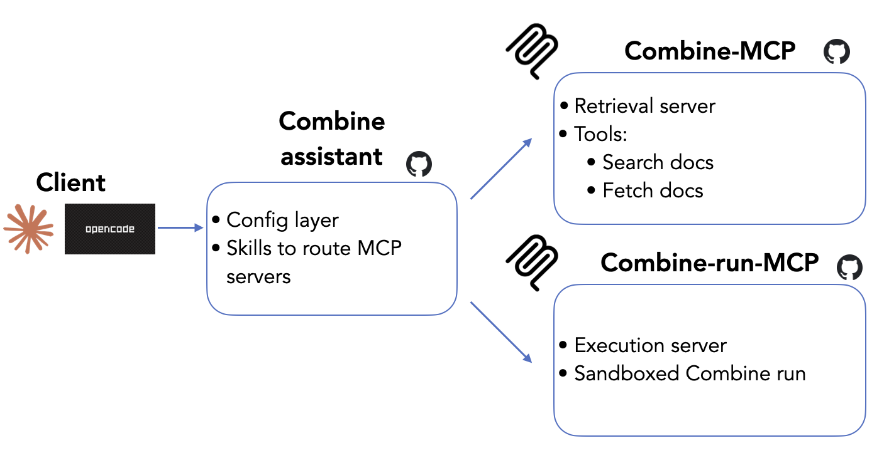
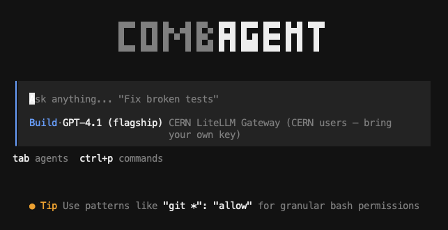

# An AI Assistant for Combine

This tutorial introduces an **AI assistant for Combine**: a chat-based agent
that answers Combine questions *with citations* to the real documentation,
paper, source code, and forum, and that can *run* Combine commands to
reproduce, diagnose, and confirm results.

It is meant to lower the barrier to using Combine. You can ask, in plain
language, "how do I set an upper limit on my signal strength?" or "why am I
getting this error from `FitDiagnostics`?", while keeping the answers grounded
in Combine's own sources rather than in a model's memory.

!!! warning "Experimental"
    This is a research prototype, not (yet) an official CMS tool. Always verify what
    it tells you against the linked sources, and review any command before you
    trust its output, especially for anything that affects a physics result.

## How it is built

You do not need to understand the internals to use it, but a quick picture
helps.

<!-- TODO(image): architecture diagram — agent in the middle, retrieval MCP and
     execution MCP on one side, the skill on the other. Add as architecture.png -->


There are three ingredients:

- **The agent**: the chat client you talk to. Two are supported:
  **combagent** (a lightweight terminal client, published on CVMFS so there is
  nothing to install on lxplus) and **Claude Code** (Anthropic's client, handy
  if you already use it locally).
- **MCP servers**: the "tools" the agent is allowed to call. There are two: a
  **retrieval** server that searches four Combine sources (the documentation,
  the [Combine paper](https://arxiv.org/abs/2404.06614), the source code, and
  the [cms-talk statistics forum](https://cms-talk.web.cern.ch/c/physics/cat/cat-stats/279)),
  and an **execution** server that runs Combine commands.
- **A skill**: a short set of instructions that tells the agent *how* to use
  Combine: which source to consult for which kind of question, how to read the
  output, and to always cite what it found.

The retrieval server means the agent does not guess: when you ask a question, it
searches the real sources and answers with links you can click to verify.

## Running Combine: two paths

When you ask the agent to actually *run* something, it uses one of two paths, in
order of preference.

1. **Your own Combine environment (recommended).** If you have `combine` on your
   `PATH` — i.e. you sourced a Combine environment (`cmsenv` inside a CMSSW
   release) *before* launching the agent — it simply runs Combine in your
   current working directory, against your real datacards, with no size limits.
   This is the main mode and the one this tutorial uses.

2. **A remote execution server (fallback).** If Combine is *not* on your `PATH`,
   the agent falls back to a shared execution server running on CERN's cloud
   (PaaS). It ships Combine itself and runs your command in an isolated sandbox,
   so it works even with no local Combine install — but inputs are size-capped
   and timeouts are shorter, so it is best for quick checks rather than large or
   long fits.

!!! tip
    For any real analysis work, use path 1: source your Combine environment
    first. You then get your real files, your real outputs, and no upload
    limits.

## Choosing a model

The agent needs a large language model behind it. Several are pre-configured;
you pick one with the `--model <provider>/<model>` flag (or use the default).

| Provider | How to access | Notes |
|---|---|---|
| **`litellm`** (default) | A key from the **CERN LiteLLM gateway** | Recommended for CERN users. Data stays within CERN's governed gateway. |
| `anthropic` | Your own Anthropic API key | Claude models via the public API. |
| `nrp` | A free token from the [National Research Platform](https://nrp.ai/llms/) | Open-weight models, free for researchers from American universities. |
| `cern-vm` | Nothing (self-hosted) | No key at all, but **CPU-only and very slow** — a last-resort fallback. |

For most CERN users the **`litellm`** provider is the right default. 
If you don't have a subscription, a LiteLLM token can be obtained by subscribing to the e-group at this website [https://gms.web.cern.ch/group/lumi-api-access](https://gms.web.cern.ch/group/lumi-api-access).
The key can then be exported by typing:

```shell
export LITELLM_API_KEY=<your-key>
```

To switch model for a session, pass `--model`, e.g. to use the (slow,
no-key) self-hosted model:

```shell
opencode --model cern-vm/qwen2.5-coder:7b
```

## Example 1: combagent on lxplus (main workflow)

This is the recommended way to use the assistant. Everything is on CVMFS, so
there is nothing to install.

**Step 1: source a Combine environment** so that `combine` is on your `PATH`.
Use your own CMSSW area with Combine built in it (see the
[installation instructions](https://cms-analysis.github.io/HiggsAnalysis-CombinedLimit/latest/#within-cmssw-recommended-for-cms-users)):

```shell
cd /path/to/CMSSW_14_1_0_pre4/src
cmsenv
cd /path/to/your/analysis    # where your datacards live
```

**Step 2: source the assistant setup.** This puts the `combagent` client on
your `PATH` and wires in the Combine tools, skill, and model configuration:

```shell
source /cvmfs/cms-griddata.cern.ch/cat/sw/combine-assistant/latest/bin/setup.sh
export LITELLM_API_KEY=<your-key>
```

**Step 3: launch the agent:**

```shell
combagent
```

You should see the **combagent** banner, and you can start chatting.

<!-- TODO(image): screenshot of the combagent banner / a first prompt.
     Add as combagent_lxplus.png -->


Some things to try:

- *"What does the `--robustFit` option do, and when should I use it?"* — the
  agent searches the docs and answers with a link.
- *"Run an asymptotic upper limit on `datacard.txt` and report the expected
  limit."* — because you sourced Combine in step 1, it runs
  `combine -M AsymptoticLimits -d datacard.txt` in your directory and reports
  the result.
- *"I get `Error: ... covariance matrix ...` from FitDiagnostics — what's going
  on?"* — the agent checks the forum and code and proposes a fix.

!!! note
    The `litellm` and `nrp` models require the CERN network (lxplus/SWAN, or
    VPN). The self-hosted `cern-vm` model is CERN-network-only as well.

## Example 2: Claude Code, locally

If you already use [Claude Code](https://claude.com/claude-code) on your own
machine, you can use the same Combine tools and skill from there.

**Step 1: get the assistant configuration** (it ships the tool registrations
and the skill):

```shell
git clone https://github.com/maxgalli/combine-assistant.git
cd combine-assistant
```

**Step 2: (optional) source a Combine environment** in the same shell if you
want commands to run against a local Combine install; otherwise the remote
execution server is used automatically.

**Step 3: launch Claude Code** in that directory:

```shell
claude
```

Claude Code automatically registers the Combine retrieval and execution servers
and discovers the skill, and it uses its own (Anthropic) model — so there is no
separate model key to configure. You can then ask the same kinds of questions as
above.

!!! tip
    On a laptop with no Combine installed and no CERN network, the agent can
    still *answer* questions (retrieval works over the public sources) but
    cannot *run* Combine. Source a Combine environment, or use it from lxplus,
    to enable execution.

## Where to go next

- Ask the agent itself how to do a specific task (that is what it is for).
- Cross-check its citations: every answer should point at the docs, paper,
  code, or forum. If it cannot find something, it will say so rather than
  guess.
- For the underlying Combine methods it drives, see the rest of these
  tutorials and the [documentation home page](https://cms-analysis.github.io/HiggsAnalysis-CombinedLimit/latest/).
